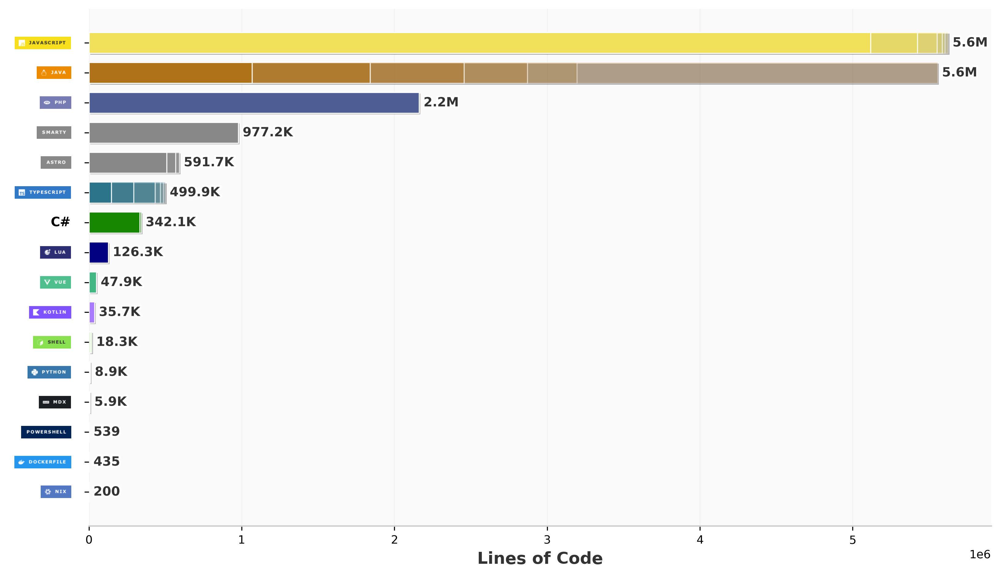

<h1 align="center">Hey, I'm Cufufy 👋</h1>

  Backend-focused developer • Minecraft server/plugin builder • homelab tinkerer

  <a href="https://www.classicraft.org/">ClassiCraft</a>
  ·
  <a href="https://github.com/cufufy?tab=repositories">Repositories</a>

---

## About me

- I like building backend systems, game/server tooling, and community-focused projects
- Most of my work revolves around Java, Node.js/TypeScript, PostgreSQL, Linux, and automation
- I enjoy Minecraft server development, networking-heavy systems, and experimenting with infrastructure

## Current focus

- Minecraft server systems and plugins
- Backend and networking projects
- Homelab / virtualization / self-hosted tooling

## Tech I work with

  
  
  
  
  
  
  
  

## GitHub stats

## Language analytics

## Featured projects

- **ClassiCraft** — Minecraft server/community project
- **IssueTracking** — issue tracker for Cufufy projects
- **Outter** — Discord-alternative app concept and development work

  
<b>More profile stuff</b>

   

  

   

  

